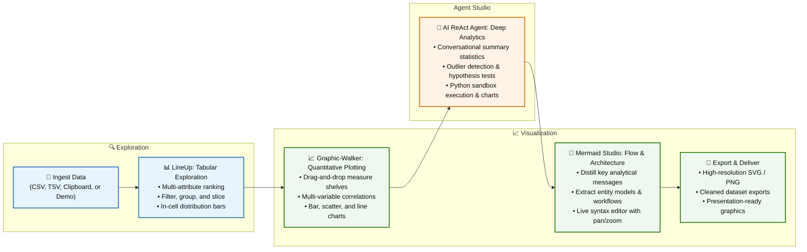

# Dataviz-Agent

**A powerful, local-first data exploration and visualization suite with an AI data analysis agent.** Explore datasets interactively using various visualization engines, and let an AI agent write Python code to analyze data and generate charts on demand.

> [!TIP]
> 🚀 **Live Demo available at [dataviz.mooo.com](https://dataviz.mooo.com)** — Try Dataviz-Agent instantly without installation!

[](https://dataviz.mooo.com)
[](https://github.com/albortino/dataviz-agent/releases)
[](https://www.docker.com/)
[](LICENSE)
[](https://www.python.org/)

---

## Overview

**Dataviz-Agent** bridges the gap between interactive browser-based visual data exploration and automated computational data science. All core visualizers run **100% in your browser** with zero mandatory data egress, while an integrated **ReAct Python Agent** handles complex statistical queries, data transformations, and custom plotting via Pandas, NumPy, Matplotlib, and Seaborn within an AST-sandboxed execution environment.

---

## Example Workflow

The following flowchart demonstrates an end-to-end analytical workflow using the integrated suite:



---

## Key Functionalities & Visual Engines

### 1. Multi-Attribute Ranking & Exploration
*Powered by [LineUp.js](https://lineup.js.org/)*
- **Complex Multi-Column Ranking**: Rank and compare thousands of rows with weighted composite scores, min/max combinations, and nested groupings.
- **Dynamic Visual Encodings**: Render numerical values as horizontal bars, heat cells, sparklines, or categoricals as color-tagged badges.
- **Interactive Filtering & Slicing**: Instant client-side search, category filtering, numerical range brackets, and hierarchy drill-downs.

### 2. Multidimensional Analytics
*Powered by [Graphic-Walker](https://github.com/Kanaries/graphic-walker)*
- **Drag-and-Drop Visual Exploration**: Intuitive shelf system for Dimensions, Measures, Color, Size, Shape, Rows, and Columns.
- **Automated Chart Recommendations**: Instant discovery of trends, distributions, and multi-variable correlations.
- **Vega-Lite Powered Rendering**: Rich interactive bar, line, area, scatter, heatmap, and box-plot graphics.

### 3. 3D Unit Particle Visualizations
*Powered by [Microsoft Research SandDance](https://microsoft.github.io/SandDance/)*
- **Every Row is a Particle**: Visualize every single record in your dataset as a tangible 3D cube or 2D mark.
- **Fluid Visual Transitions**: Seamlessly animate between scatter plots, stacks, density cubes, and treemaps without losing track of individual data points.
- **3D Camera & Faceting**: Rotate, pan, and zoom in 3D space with categorical color encodings and facet grids.

### 4. Flow & Pathway Diagrams
*Powered by [D3.js & SankeyMatic](https://sankeymatic.com/)*
- **Flow Visualizations**: Map multi-stage transfers, user funnels, budget allocations, and conversion pipelines.
- **Live Tabular-to-Sankey Generator**: Pick Source, Target, and Value columns from your dataset to instantly render flows.
- **Interactive Customization**: Drag-and-drop nodes, customize node alignment (justify, left, right, center), modify link curvature, and export high-resolution SVGs.

### 5. Interactive Diagram Studio
*Powered by [Mermaid.js](https://mermaid.js.org/)*
- **Dynamic Diagram Types**: Generate Flowcharts, Sequence Diagrams, State Diagrams, Entity-Relationship (ER) Models, Mindmaps, Class Diagrams, and Gantt charts.
- **Pan, Zoom & Live Edit**: Full SVG pan/zoom canvas with syntax highlight editor, error recovery, and auto-beautification.
- **Tabular Auto-Extraction**: Automatically derive entity relationships, process workflows, and hierarchical trees directly from CSV columns.

### 6. AI-Assisted Analysis
- **Conversational Analytics**: Ask questions in plain language (e.g., *"What is the correlation between revenue and ad spend by region?"*, *"Find outliers and plot a distribution"*).
- **Sandboxed Python Code Execution**: The agent writes and executes Python code in real-time, computing metrics with Pandas / Numpy and rendering custom Matplotlib / Seaborn charts inline.
- **Transparent ReAct Loop**: View the agent's full reasoning chain (**Thought ➔ Action ➔ Observation ➔ Final Answer**).
- **Hybrid Speed Optimization**: Employs client-side data tools for instantaneous answers to standard statistical queries, falling back to server-side Python execution for complex analytical requests.

### 7. Flexible Data Ingestion & Transformation
- **File Upload**: Upload standard `.csv` or `.tsv` files.
- **Clipboard Paste**: Paste tabular data directly from Excel, Google Sheets, or CSV text.
- **Built-in Demo Datasets**: Explore this tool with curated sample datasets.
- **In-Browser Transformations**: Type casting, missing value handling, column renaming, and filtering.

---

## Bring Your Own Key (BYOK) & Model Providers

Dataviz-Agent offers a flexible AI architecture. You can configure global server-wide credentials or let individual users provide their own keys in the in-browser **AI Settings** modal (keys are stored safely in browser `localStorage`).

Supported provider presets include:
- **DeepSeek Flash** (`https://api.deepseek.com`)
- **OpenAI GPT-5.6 Terra / GPT-4o** (`https://api.openai.com/v1`)
- **Google Gemini Flash** (`https://generativelanguage.googleapis.com/v1beta/openai/`)
- **Anthropic Claude Sonnet** (`https://api.anthropic.com/v1`)
- **Local Ollama** (`http://localhost:11434/v1`)
- **OpenRouter Gateway** (`https://openrouter.ai/api/v1`)

---

## Quickstart

> [!TIP]
> Explore a live demo of Dataviz-Agent at [dataviz.mooo.com](https://dataviz.mooo.com)!

### Option 1: Docker (Fastest)

```bash
# 1. Build the Docker image
docker build -t dataviz-agent .

# 2. Run container
docker run -d --name dataviz-agent -p 8000:8000 dataviz-agent
```

Open [http://localhost:8000](http://localhost:8000) in your browser.

*(Optional)* Run with default server-side LLM credentials:
```bash
docker run -d --name dataviz-agent -p 8000:8000 \
  -e LLM_API_KEY="your-api-key" \
  -e LLM_BASE_URL="https://api.deepseek.com" \
  -e LLM_MODEL="deepseek-flash" \
  dataviz-agent
```

---

### Option 2: Local Python Environment

**Requirements:** Python 3.10+ (Tested on Python 3.10 – 3.14)

```bash
# 1. Clone the repository
git clone https://github.com/albortino/dataviz-agent.git
cd dataviz-agent

# 2. Create and activate a virtual environment
python3 -m venv .venv
source .venv/bin/activate

# 3. Install dependencies
pip install -r requirements.txt

# 4. Start the application
uvicorn src.main:app --host 0.0.0.0 --port 8000 --reload
```

---

## Pro Tips & Best Practices

### 1. Visual Engine Selection Guide

| Task / Use Case | Recommended Engine | Why? |
| :--- | :--- | :--- |
| **Tabular Sorting & Multi-Column Scoring** | **LineUp** | Instant ranking, weighted composite columns, and in-cell distribution bars. |
| **Exploratory Data Analysis (EDA)** | **Graphic-Walker** | Tableau-like drag-and-drop shelves for rapid correlation & distribution plots. |
| **Granular Point-Level Analysis (Up to 100k rows)** | **SandDance** | 3D unit visualization where every row remains an interactive tangible particle. |
| **Process, Budget, or Funnel Flow** | **Sankey** | Interactive multi-stage flow mapping with customizable curvature and alignment. |
| **Architecture & Entity Relationships** | **Mermaid** | Live code-to-diagram generation with SVG pan/zoom and auto-extraction from tabular data. |
| **Complex Math, Outliers, or Custom Modeling** | **AI Agent** | Sandboxed Python engine running Pandas, NumPy, Matplotlib, and Seaborn. |

### 2. Dataset Sizing & Performance Optimization

> [!TIP]
> - **In-Browser Visualizers (LineUp, Graphic-Walker, Sankey)**: Perform best on datasets between **1,000 and 50,000 rows**.
> - **SandDance 3D Engine**: Uses WebGL hardware acceleration to handle up to **100,000 unit particles** smoothly.
> - **Large Files (>100k rows)**: Use the **Data Transformation** tab to filter rows or aggregate dimensions before opening memory-heavy 3D tabs.

### 3. Local-First Privacy & Zero Data Egress

> [!IMPORTANT]
> - All visual rendering engines (LineUp, Graphic-Walker, SandDance, Sankey, Mermaid) execute **100% inside your local web browser**.
> - Tabular data is **never** sent to any external server unless you explicitly prompt the **AI Chat Agent**.
> - When using the AI Agent with a local **Ollama** model, your data remains strictly on your local machine / private server.

### 4. Running 100% Locally with Ollama

To run completely offline without cloud API keys:
1. Install [Ollama](https://ollama.com/) and pull a model (e.g. `ollama run llama3.2` or `ollama run qwen2.5-coder`).
2. In Dataviz-Agent, click **AI Settings**.
3. Select the **Ollama Local** preset (`http://localhost:11434/v1`).
4. Type your model name (e.g. `llama3.2`) and click **Test & Save Credentials**.

### 5. High-Resolution Exports

- **Sankey Diagrams**: Export crisp vector graphics directly via the **Export SVG** button in the control panel.
- **Mermaid Diagrams**: Click **Export SVG** or **Export PNG** for presentation-ready architecture charts.
- **Graphic-Walker**: Export Vega-Lite specs, PNG, or SVG figures from the top-right canvas menu.
- **AI Agent Charts**: Right-click generated inline Matplotlib/Seaborn plots to save high-resolution PNG images.

---

## Self-Hosting & Production Deployment

Dataviz-Agent is designed to be lightweight and simple to self-host on everything from a Raspberry Pi or home server to a cloud VPS.

👉 **Read the comprehensive [SELF-HOSTING.md](SELF-HOSTING.md) guide** for Docker Compose setups, resource limits, and environment variable configuration.

---

## Tech Stack

- **Backend**: [FastAPI](https://fastapi.tiangolo.com/), [Uvicorn](https://www.uvicorn.org/), [Pandas](https://pandas.pydata.org/), [NumPy](https://numpy.org/), [Matplotlib](https://matplotlib.org/), [Seaborn](https://seaborn.pydata.org/), [OpenAI Python SDK](https://github.com/openai/openai-python)
- **Frontend**: Vanilla Modern JavaScript (ES6+), CSS3 with Design Tokens, Semantic HTML5
- **Visualization Libraries**: [LineUp.js](https://lineup.js.org/), [Graphic-Walker](https://github.com/Kanaries/graphic-walker), [SandDance](https://microsoft.github.io/SandDance/), [D3.js / d3-sankey](https://d3js.org/), [Mermaid.js](https://mermaid.js.org/), [Panzoom](https://github.com/timmywil/panzoom)

---

## Contributing

We welcome contributions of all kinds! Whether you want to add a new visualization engine, create agent tools, or improve UI/UX, please check out [CONTRIBUTING.md](CONTRIBUTING.md) for architecture details, development setup, and PR standards.

---

## License

This project is licensed under the [MIT License](LICENSE).
